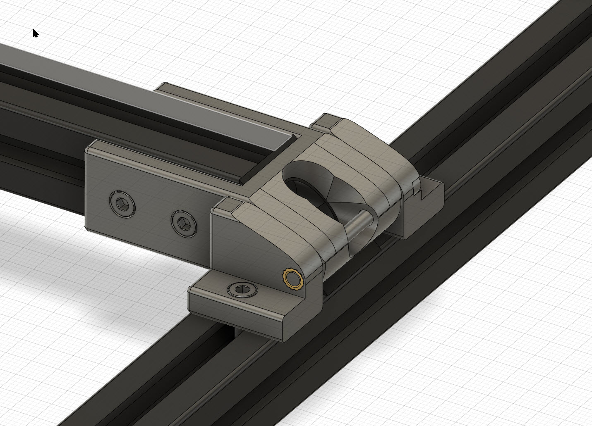

GK

# Car Hood style mod

Yet another car hood mod here, but this one retains original 2.4 corner pieces allowing you to bolt that bed perfectly level with the frame after you're done tinkering with the electronics box
In unlikely chance that your printed hinge melts your bed won't sag into your electronics compartment, GOOD.

## Printing

Usual voron settings but with minor supports on some parts

